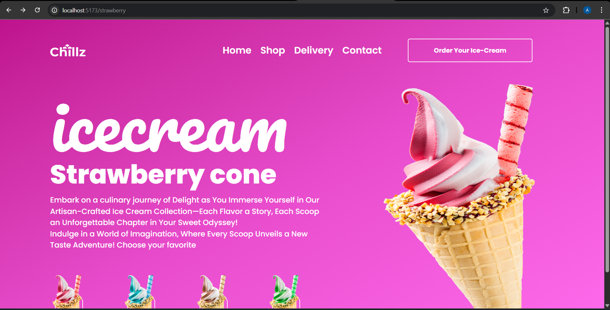
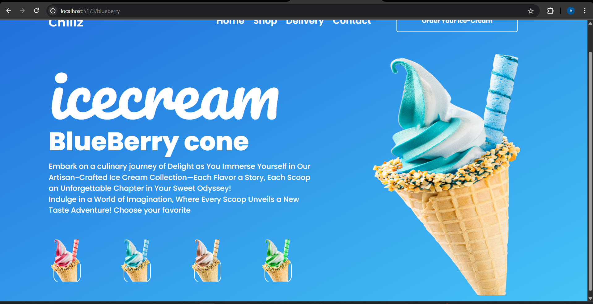
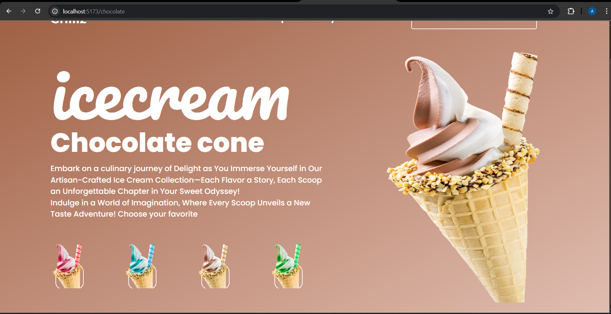
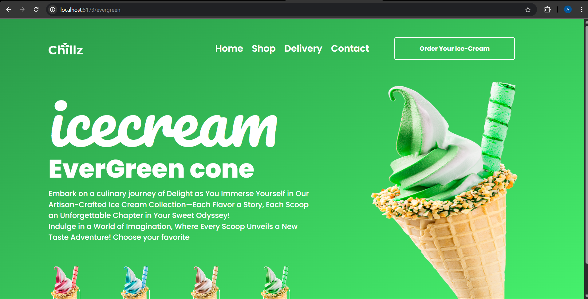

# 🍦 Code-X-Novas - Ice Cream Landing Page

It is a **responsive landing page UI** for an ice cream-selling brand. Developed as part of a frontend assignment, the design was implemented based on a given **Figma prototype** using **React.js** and **Tailwind CSS**. The application structure is clean, modular, and ready for scaling into a full product site. Routing support is included to match modern frontend development standards.

---

🔗 **Live Demo:** [https://code-x-novas-assignment.vercel.app/](https://code-x-novas-assignment.vercel.app/)  
📁 **GitHub Repo:** [https://github.com/anubhav-0004/code-x-novas-assignment](https://github.com/anubhav-0004/code-x-novas-assignment)

---

## 🛠 Tech Stack

### Frontend:
- React.js
- Tailwind CSS
- React Router
- Vite

---

## 🎨 Features
- **Fully responsive** layout for mobile and desktop devices.
- **Reusable components** for scalability.
- **Clean folder structure** for easy development.
- **Utility-first styling** with Tailwind CSS.

---

## 📸 Screenshots

### 🔻 Landing Page Preview





---

## 📁 Folder Structure

src/
├── pages/
│   ├── Strawberry.jsx        # Landing page for strawberry flavor
│   ├── Blueberry.jsx         # Landing page for blueberry flavor
│   ├── Chocolate.jsx         # Landing page for chocolate flavor
│   ├── Evergreen.jsx         # Landing page for evergreen flavor
│   └── NotFound.jsx          # 404 fallback page
│
├── components/
│   ├── Navbar.jsx            # Top navigation bar
│   ├── Options.jsx           # Flavor selector or features section
│
├── assets/
│   ├── images/               # Ice cream images.
│  
│
public/
│   ├── Logo                  # Fevicon Logo
│   └── screenshots/          # Screenshots for README or showcase
│
.gitignore                    # Files and folders to ignore by Git
eslint.config.js             # ESLint configuration file
vite.config.js               # Vite project configuration
README.md                    # Project documentation


---

## ⚙️ Installation & Setup

### 1️⃣ Clone the repository
```bash
git clone https://github.com/anubhav-0004/code-x-novas-assignment.git
cd code-x-novas-assignment
```
```bash
npm install
```
```bash
npm run dev
```

---

## 🚀 Deployment(Vercel)

1. Push changes to GitHub.
2. Link the GitHub repo to **Vercel**.
3. Deploy and access the frontend live link.